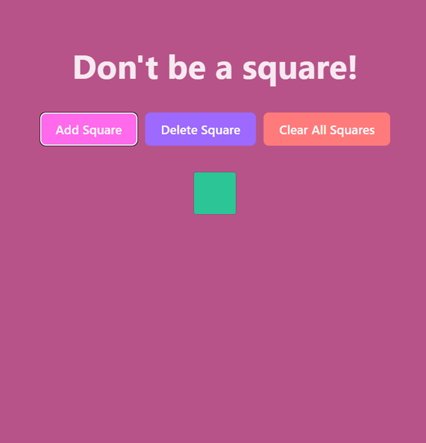
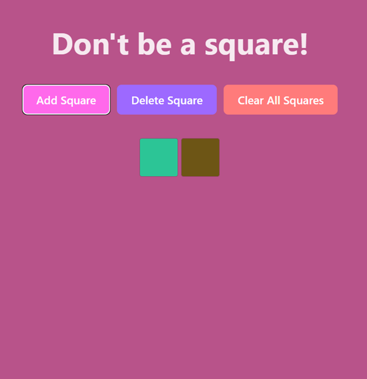
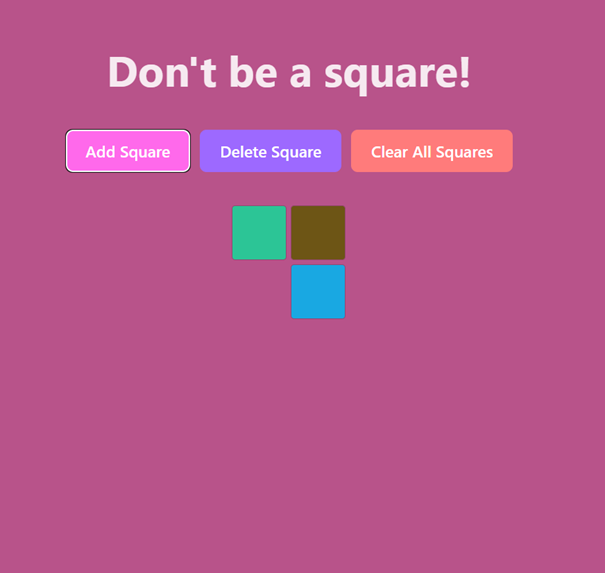
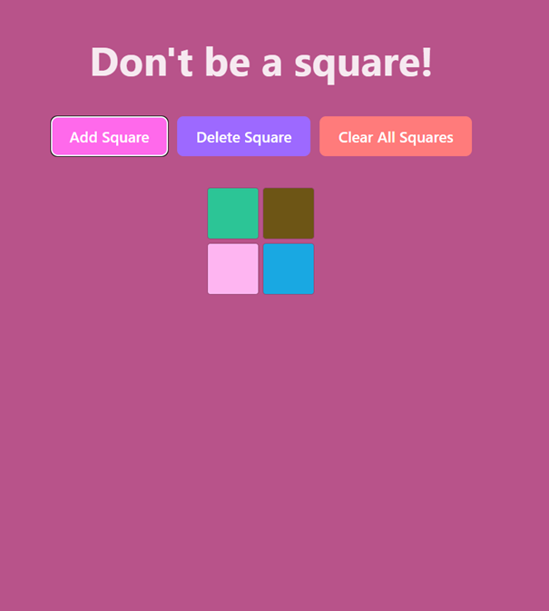
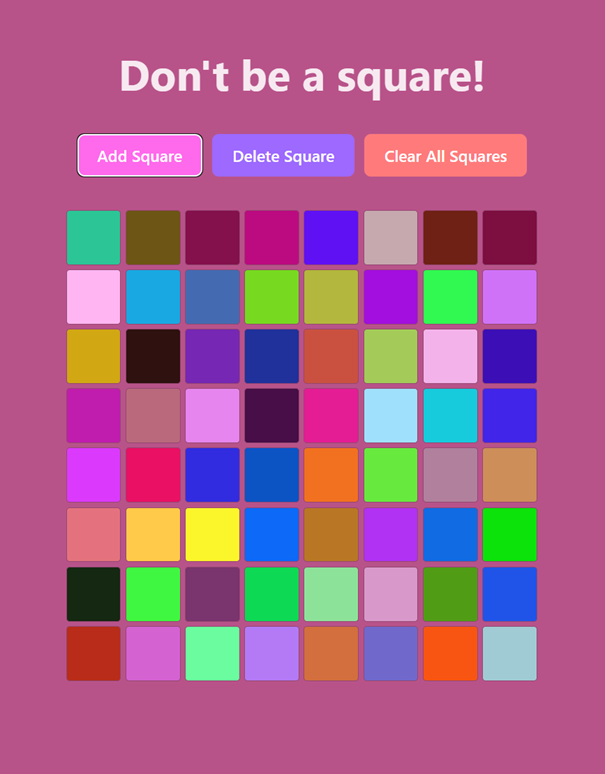

# Don't be a square!
> A fun and interactive React app that lets users add, delete, and clear colored squares on a grid by using SquareAPI. Built with **React**, **CSS**, and **Vite**.

---

## 📸 Example: Square Pattern Progression

Below is a visual demonstration of how the grid changes as squares are added:

### Adding Squares Step-by-Step

| Step 1 | Step 2 |
|--------|--------|
|  |  |

| Step 3 | Step 4 |
|--------|--------|
|  |  |

### After a few layers

> These images demonstrate how the grid expands as more squares are added, based on their `x` and `y` coordinates from the API.

---

## Features

- Add new colored squares
- Delete the most recently added square
- Clear all squares at once
- Grid auto-expands based on square coordinates

---

## Components

- Header - title of the page
- ControlPanel - buttons for adding, deleting and clearing squares
- SquareGrid - calculates and renders the grid by using square component
- Square - renders the squares in the grid
- ErrorMessage - renders error messages

## API Configuration

This app relies on a backend API to function properly (see my other repo: SquareAPI). By default, it connects to:
https://localhost:7142/api/Square

### Created by
Smilla Hallgren Larsson
